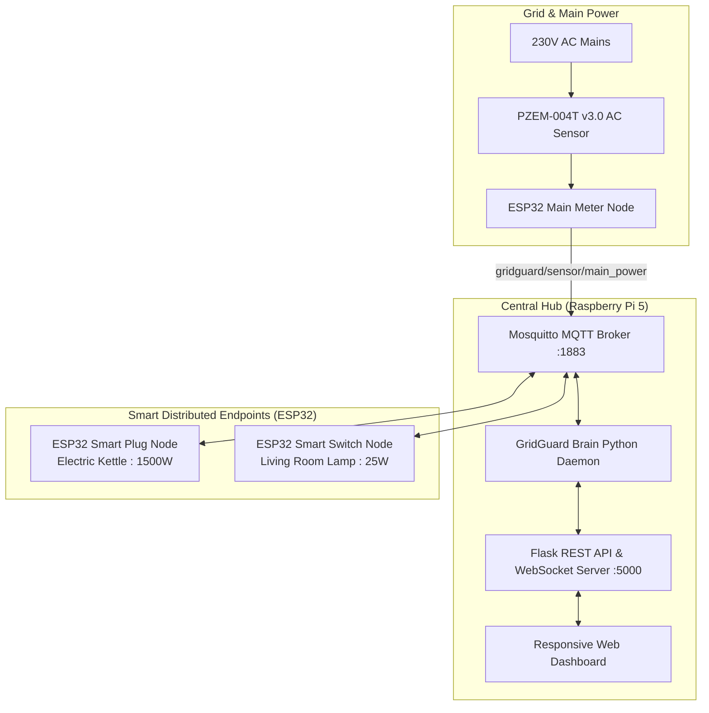

# ⚡ GridGuard: Smart Demand-Response Home Energy Engine

[](https://www.raspberrypi.com/)
[](https://www.espressif.com/)
[](https://mosquitto.org/)
[](https://innovatorsguru.com/pzem-004t-v3/)
[](https://flask.palletsprojects.com/)
[](#-web-dashboard-architecture)

> 📖 **Master Specification**: For complete pinouts, schematics, MQTT contracts, and state machines, see [`SYSTEM_SPECIFICATION.md`](SYSTEM_SPECIFICATION.md).  
> 🎮 **Standalone Simulator**: Run the complete interactive system in your browser without hardware via [`demo_simulator.html`](demo_simulator.html).

---

## 🌟 Executive Summary

**GridGuard** is an autonomous IoT Home Demand-Response and Energy Optimization Hub designed to stabilize the power grid and reduce household electricity bills under Time-of-Use (TOU) tariffs. 

During expensive utility peak hours (e.g., 18:30 – 22:30), GridGuard automatically identifies energy-intensive deferrable loads (such as a 1,500W electric kettle) using **Delta-P power disaggregation** and defers their operation, while keeping essential low-power loads (such as 25W lighting) completely uninterrupted. A seamless **Human-in-the-Loop Override** ensures users can instantly bypass restrictions whenever needed.

---

## 🏗️ System Architecture



---

## 🚀 Key Engineering Capabilities

1. **⚡ Autonomous Peak Demand-Response**:
   - Continuously monitors utility peak window (configurable, default: `18:30 – 22:30`).
   - If an appliance drawing $>1000\text{W}$ activates during peak hours, GridGuard intercepts the load within 5 seconds, issues a `DELAY` command, and powers off the relay.
   - Essential lighting loads ($<1000\text{W}$) remain active with zero delay.

2. **🔍 5-Second Delta-P Disaggregation**:
   - Eliminates the need for expensive individual energy meters on every socket.
   - When a node toggles, the central engine records baseline power, opens a 5-second ramp-up observation window, and disaggregates the exact delta wattage ($P_{\text{peak}} - P_{\text{baseline}}$) attributed to that specific node.

3. **🔄 Human-in-the-Loop Override**:
   - If an appliance is intercepted, the dashboard button dynamically turns into a **Yellow ⚡ OVERRIDE** button.
   - Pressing the override button (or the physical button on the ESP32) immediately re-energizes the appliance.

4. **⏱️ Real-Time Countdown Timers & Daily Schedules**:
   - Users can set custom countdown timers (e.g., 15m, 30m, 60m, or custom minutes) with animated live countdown pills (`⏱️ Turn OFF in Xm Ys [✕]`) and instant cancel.
   - Built-in 24-hour daily automated scheduling (`ON` / `OFF` times).

5. **📊 TOU Tariff Analytics & Monthly Bill Prediction**:
   - Calculates real-time cost based on off-peak (`LKR 25.0/kWh`) and peak (`LKR 30.0/kWh`) rates.
   - Predicts monthly billing based on multi-day historical burn rates (~113 kWh / ~LKR 3,112/month for typical households).
   - Tracks **Peak Savings**: Accumulates energy shifted away from peak hours (kWh) and real money saved (LKR).

6. **🎮 Zero-Hardware Standalone Simulator**:
   - Includes a self-contained simulation web application with the complete in-memory engine, allowing anyone to test, demonstrate, and record presentation videos with 1 click.

---

## 🛠️ Hardware Pinouts & Wiring Specifications

### 1. Central Hub (Raspberry Pi 5)
* **OS**: Raspberry Pi OS (Bookworm 64-bit)
* **Services**: Mosquitto MQTT Broker (`port 1883`), Flask Web Server (`port 5000`)
* **Default IP**: `10.99.209.171` | **Hostname**: `gridguardpi.local`

### 2. IoT Microcontroller Nodes (ESP32)

| Node ID | Friendly Name | Hardware Relay | Physical Input | Connection LED (Green) | Status LED (Red) | MQTT Topics |
| :--- | :--- | :--- | :--- | :--- | :--- | :--- |
| `smart-plug-1` | **Electric Kettle (1500W)** | **GPIO 4** (Active HIGH) | **GPIO 18** (Active LOW, Pullup) | **GPIO 26** (Solid = Online) | **GPIO 27** (Solid = ON, Blink = DELAY) | `gridguard/nodes/smart-plug-1/command`<br>`gridguard/nodes/smart-plug-1/status` |
| `smart-switch-1` | **Living Room Lamp (25W)** | **GPIO 4** (Active HIGH) | **GPIO 18** (Active LOW, Pullup) | **GPIO 26** (Solid = Online) | **GPIO 27** (Solid = ON, Blink = DELAY) | `gridguard/nodes/smart-switch-1/command`<br>`gridguard/nodes/smart-switch-1/status` |
| `pzem-main-meter` | **Main Power Meter** | N/A | PZEM TX: **GPIO 16** (RX2)<br>PZEM RX: **GPIO 17** (TX2) | **GPIO 26** (Solid = Online) | N/A | `gridguard/sensor/main_power` |

---

## 📁 Repository Directory Structure

```text
gridguard/
├── demo_simulator.html            # 🎮 Standalone Interactive Simulator (1-Click Browser Launch)
├── simulator/                     # Zero-Hardware Simulation Package
│   ├── index.html                 # Simulator Web App (Client-side physics & demand-response engine)
│   └── README.md                  # Step-by-step Presentation & Video Recording Guide
├── SYSTEM_SPECIFICATION.md        # Master Engineering Architecture, Pinouts & State Machine Specs
├── README.md                      # Primary Project Documentation
├── pi/                            # Central Hub Code (Raspberry Pi 5)
│   ├── gridguard_brain.py         # Mastermind Engine (MQTT state machine, peak rules, tariff math)
│   ├── app.py                     # Flask Web REST API & Thread Manager
│   ├── pzem_reader.py             # PZEM-004T Serial/Simulator Driver
│   └── templates/
│       └── index.html             # Neumorphic Live Dashboard Web App
└── esp32/                         # ESP32 Firmware Sketches (Arduino C++)
    ├── plug_node/
    │   └── plug_node.ino          # Smart Heavy Appliance Plug Firmware
    ├── switch_node/
    │   └── switch_node.ino        # Smart Lighting Switch Firmware
    ├── pzem_node/
    │   └── pzem_node.ino          # PZEM-004T AC Telemetry Meter Firmware
    ├── pzem_test/
    │   └── pzem_test.ino          # Hardware Diagnostic Test for PZEM
    ├── pzem_pin_scanner/
    │   └── pzem_pin_scanner.ino   # Auto UART Pin Scanner Tool
    └── hardware_test/
        └── hardware_test.ino      # Relay & LED Diagnostic Test Sketch
```

---

## 💻 How to Run

### Mode A: Zero-Hardware Virtual Simulator (Demonstration & Video)
If you do not have the physical hardware with you:
1. Double-click [`demo_simulator.html`](demo_simulator.html) or [`simulator/index.html`](simulator/index.html).
2. It opens instantly in your default web browser (Chrome, Edge, Safari).
3. Test toggling the 25W lamp and 1500W kettle, trigger autonomous peak interception, override loads, set timers, and explore the tariff dashboard.

### Mode B: Full Physical Hardware Deployment
1. **Power up the Raspberry Pi 5**:
   ```bash
   cd /home/gridguardpi/gridguard
   python3 app.py
   ```
2. **Flash ESP32s** with their respective sketches in Arduino IDE:
   - `esp32/plug_node/plug_node.ino` $\rightarrow$ Plug Node
   - `esp32/switch_node/switch_node.ino` $\rightarrow$ Switch Node
   - `esp32/pzem_node/pzem_node.ino` $\rightarrow$ Main Power Meter
3. **Open the Web Dashboard**:
   - `http://gridguardpi.local:5000` or `http://10.99.209.171:5000`

---

## 🛡️ License & Credits
Built for **Genesiz 2026** Project Exhibition. Designed & Developed by the GridGuard Engineering Team.
- **Lead Developers**: Kavishka & Lahiru Sampath (`lahirusampath2003`)
- **Institution**: University / Genesiz 2026
